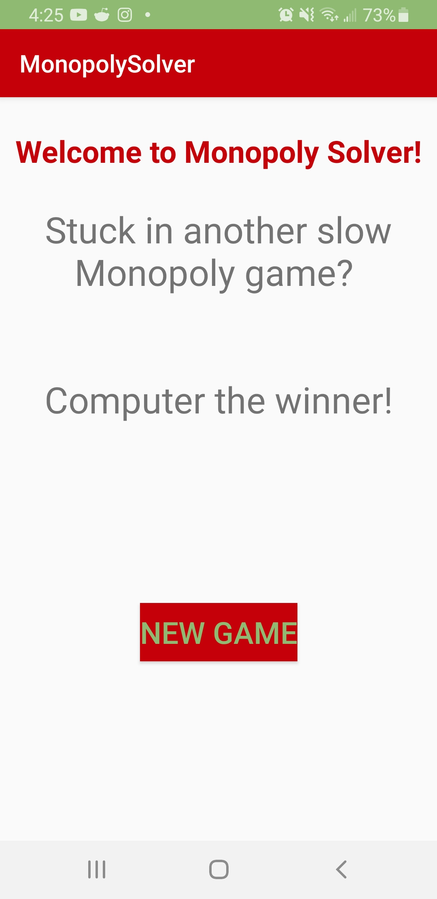
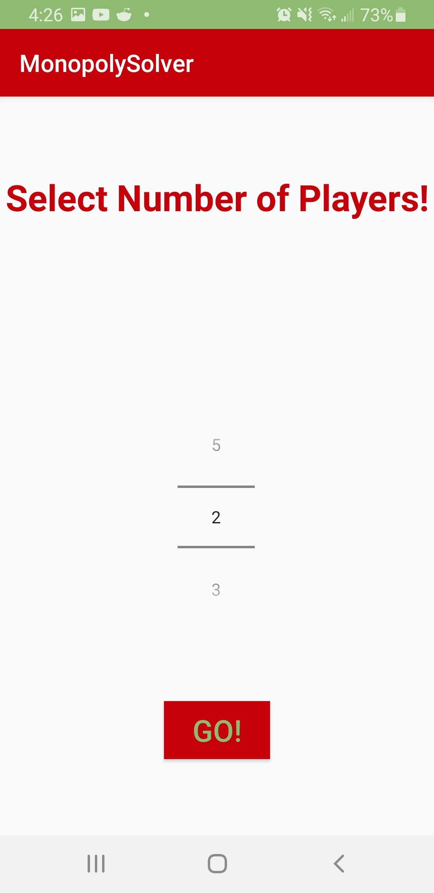
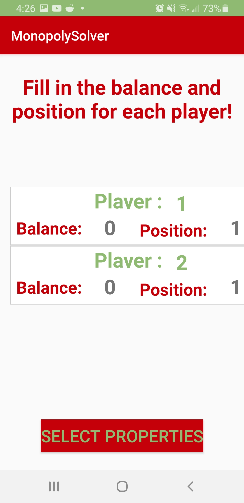
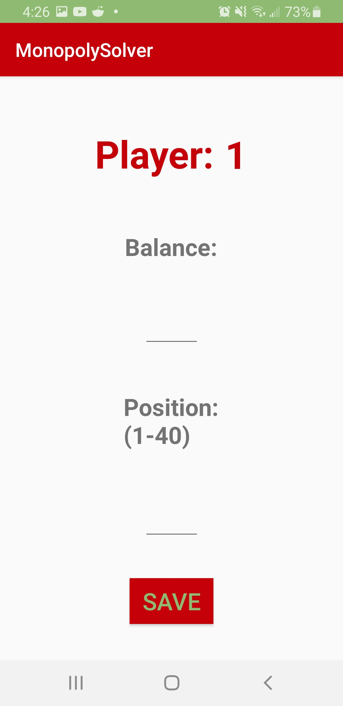
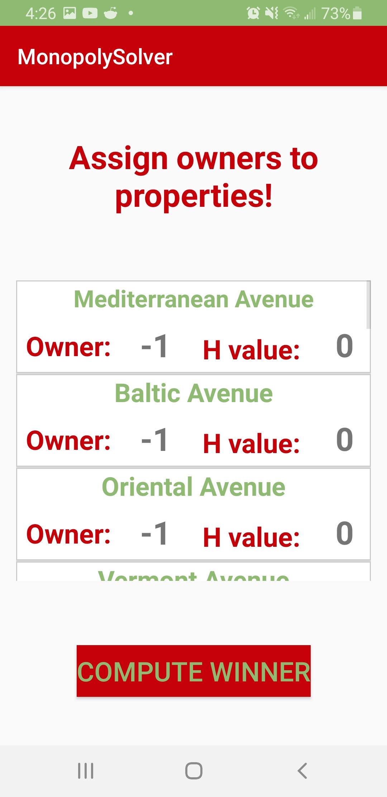
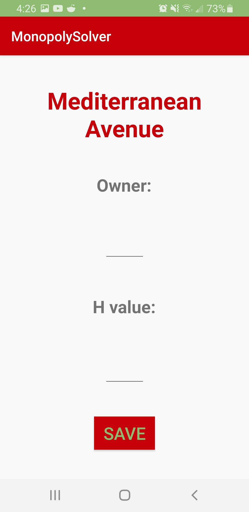
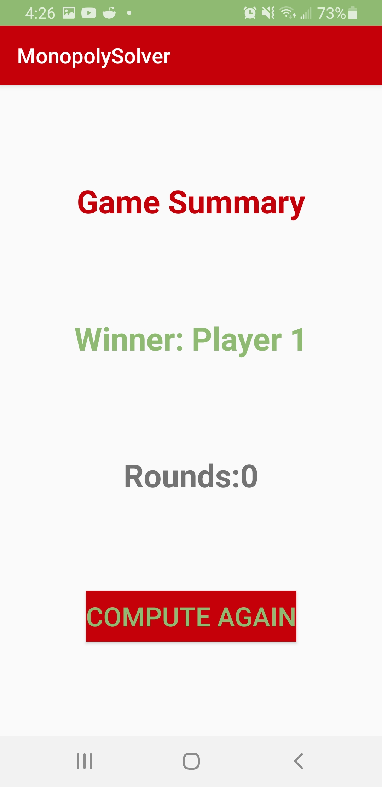

# MonopolySolver

## Summary:
### Context:
#### One day I was playing an intense game of Monopoly with my girlfriend and we reached a point in the game where it got really slow and we had bought all the properties available.  I knew this game could last hours until we'd see an end, so that's when I got the idea of Monopoly Solver.  Instead of playing the game for hours to find a winner, why not have the computer simulate the game and compute a winner?

#### This app is meant to speed the game of Monopoly up to find a winner when you no longer feel like playing, but still want to know who won.  The app helps gather all the statistics of the game such as: 
- how many players? 
- the balance each player currently has
- the position the player currently is at
- the owner of each property

#### Having all these stats about the game allows me to run it through the custom logic I wrote for Monopoly in the Java class MonopolyLogic.  The logic takes rent, pass go receive 200, and jail time into consideration.  It rolls for each player by generating two random numbers between the range of (1-6) and adding them together, simulating a pair of dice.  It keeps rolling until either a player goes bankrupt, or until a player reaches the max int value.

## First Event
<h2 align="center">This is the welcome page, go ahead and click new game.</h2>

  

## Second Event
<h2 align="center">The second event asks you to select how many players are in the game.</h2>

  

## Third Event
<h2 align="center">The third event asks you to fill in the balance and position of each player, click on the items on the list to prompt the edit event.</h2>

  

## Edit Player Balance and Position Event
<h2 align="center">This is the edit event for player and position, add the appropriate information and click on save to continue.</h2>

  

## Fourth Event
<h2 align="center">The fourth event asks you to assign owner and h-values to properties in the game. Click on the items on the list to prompt the edit event.</h2>

  

## Edit Property and H-Value Event
<h2 align="center">This is the edit event for properties.  The number of the player should be assigned to the 'Owner' entry, and the proper H-Value should be assigned to the "H-value" entry.</h2>

H-Value entry meanings:
- 0 (no house or hotel)
- 1 (1 house)
- 2 (2 houses)
- 3 (3 houses)
- 4 (4 houses)
- 5 (hotel)

  

## Final Event
<h2 align="center">In the final event the winner gets computed and gives you a break down of how the game went.  I also implemented a "compute again" button to the game again.  Since the rolls are randomized, every computed game will look different.  I wanted to give the user an option to keep rerunning the game in case they want to try their luck.</h2>

  

